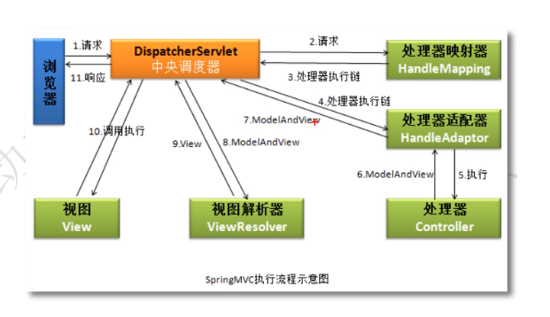
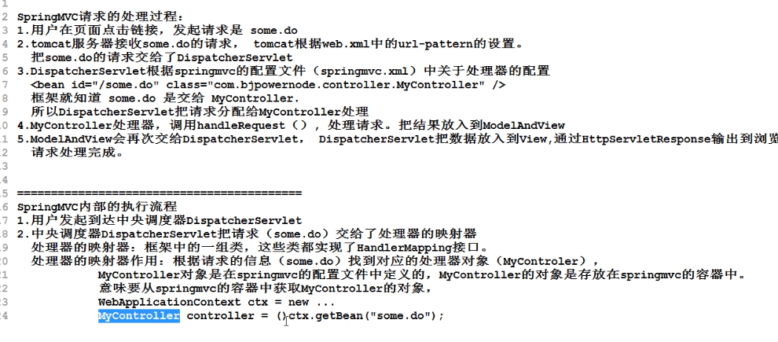
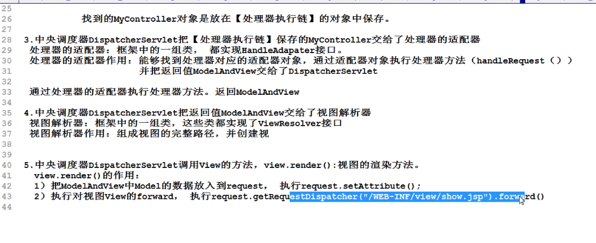
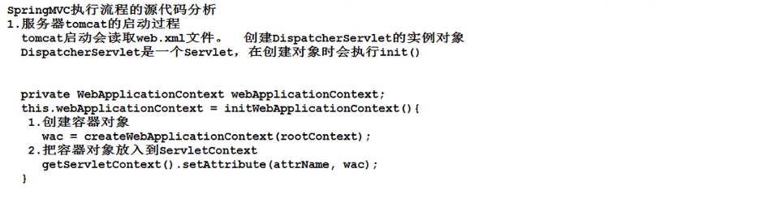
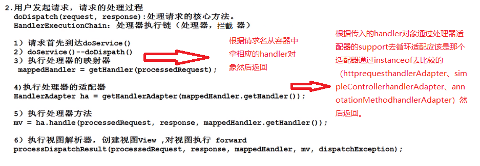

### SpringMVC概览

##### 一、请求流程：

##### 二、请求处理过程概述及内部执行流程

##### 三、源码流程概览

**解析：**

servlet的配置文件在WEB-INFO指定位置就是为了tomcat可以找到并且创建servlet。

dispatcherServlet类下有一个配置文件里边配置了所有的处理器、适配器视图解析器等。该文件在DispatcherServlet的静态代码块中随着类加载而被解析加载。

